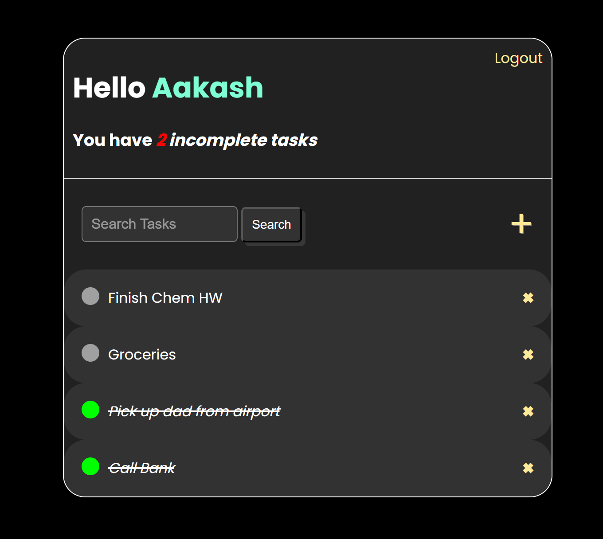

# To-Do-List
# <https://aakash1417.pythonanywhere.com/login/>

## Description
This website is a simple and user-friendly web application designed to help users keep track of their tasks and manage their to-do lists. Whether you're organizing your daily tasks, planning projects, or just need a place to jot down important notes, this website provides a convenient and efficient way to stay organized.

## How to Use
* User Authentication: Users can create accounts, log in, and securely manage their to-do lists. Each user has a personalized dashboard to track their tasks.
* Task Management: Users can create, edit, delete, and mark tasks as completed. Tasks can be organized by due date, priority, and category.
* Search and Filter: Users can search for specific tasks and filter tasks based on various criteria such as due date, category, and priority.
* Responsive Design: The website is responsive and works well on both desktop and mobile devices.

## License
This project is not licensed. [Learn more](LICENSE).

## Acknowledgments
* This project was built using the Django web framework.
* Special thanks to the Django community and the developers of various Django packages used in this project.

Enjoy my productivity tool!
